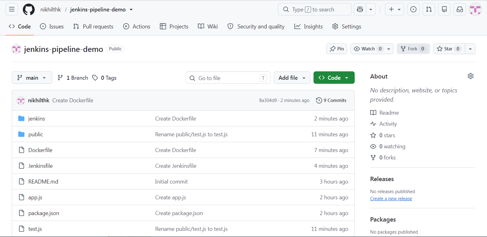
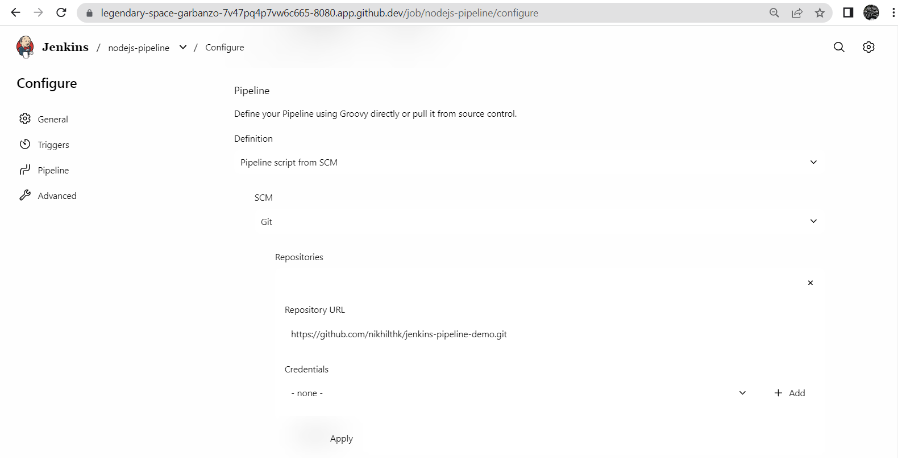
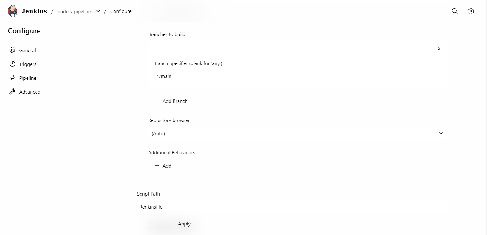
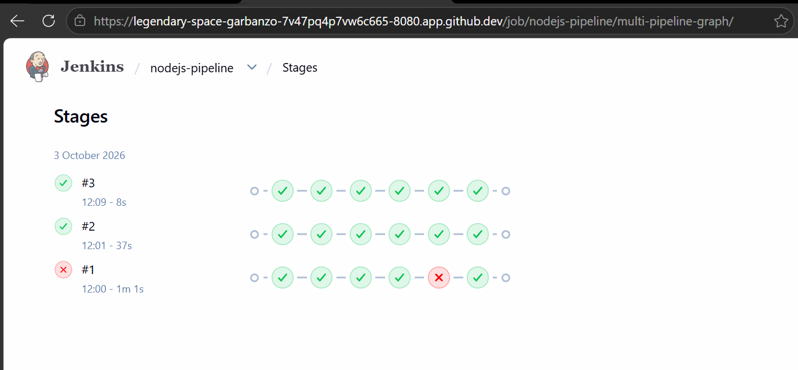
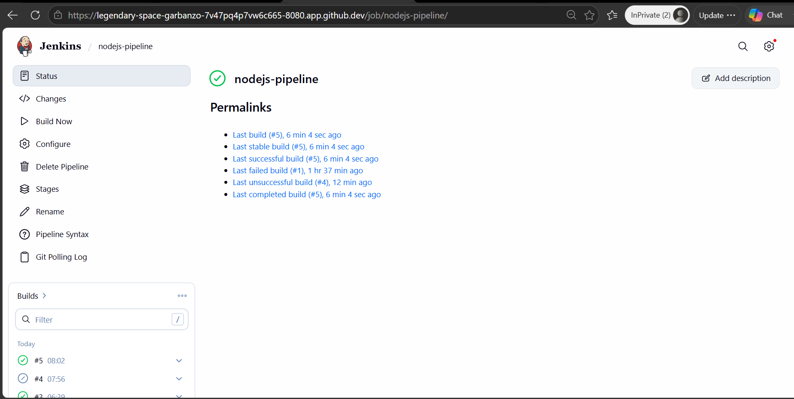
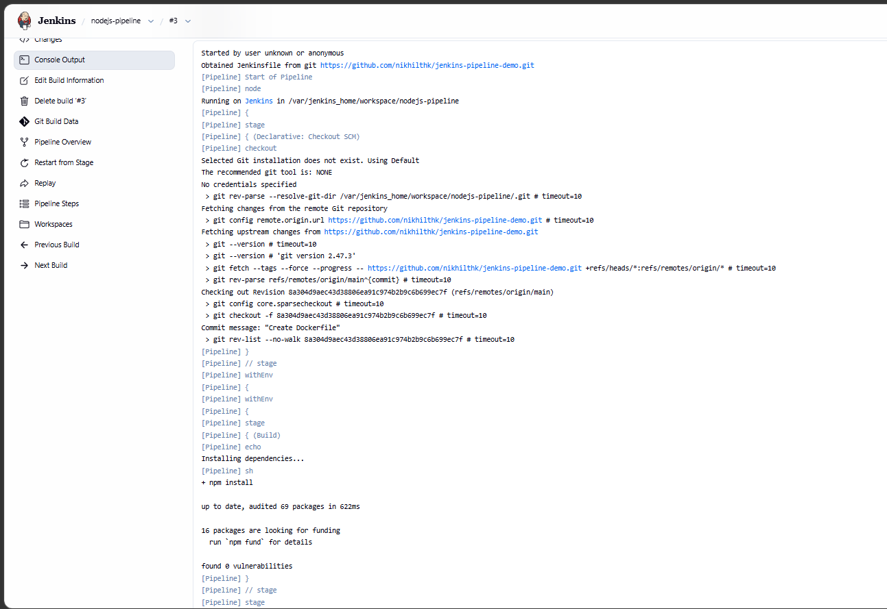
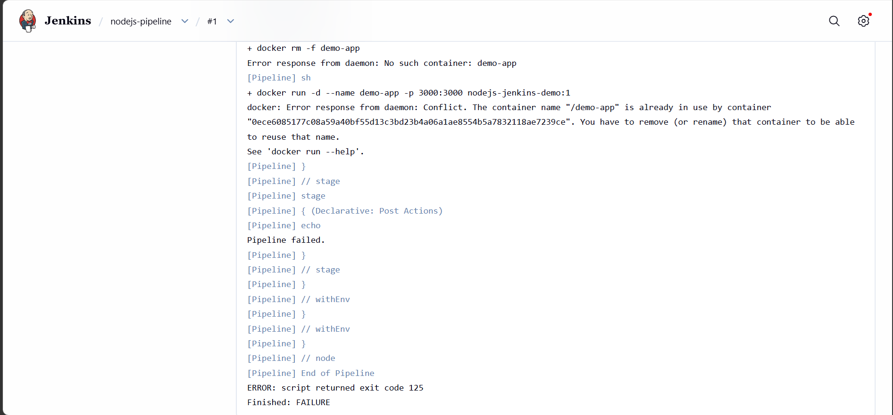
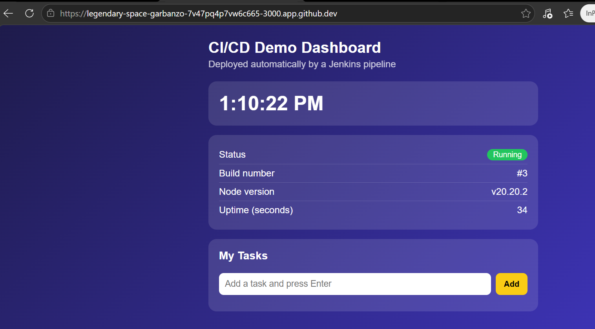

# Jenkins CI/CD Pipeline for a Node.js App

A Jenkins declarative pipeline that builds, tests and deploys a Node.js dashboard app using Docker.

## Tools
Jenkins, Docker, Node.js (Express), GitHub, GitHub Codespaces

## Pipeline Stages (Jenkinsfile)
1. **Build** - installs dependencies with `npm install`
2. **Test** - runs `test.js`, which checks the `/health` endpoint
3. **Docker Build** - builds an image tagged with the Jenkins build number
4. **Deploy** - replaces the old container and runs the new one on port 3000

The pipeline polls the repo every 2 minutes (`pollSCM`) for new commits.

## Project Files
- `Jenkinsfile` - pipeline definition
- `Dockerfile` - app container image
- `jenkins/Dockerfile` - Jenkins image with Node.js and Docker
- `app.js`, `public/index.html` - the dashboard app
- `test.js` - automated test

## Screenshots
Repo structure:

Pipeline configuration (Pipeline script from SCM):

Stage view (build #1 failed at Deploy, #2 and #3 passed):

Job overview:

Start of the build #3 log:

Failed build #1 (container name conflict):

Deployed app, showing Jenkins build #3:

Full log of build #3: [console-output-build3.txt](console-output-build3.txt)

## Setup Notes
Jenkins ran in a Docker container inside a GitHub Codespace, with access to the Docker socket. Triggering uses SCM polling because a Codespace has no stable public URL for webhooks.

## Issues Faced
- `test.js` was first created in the wrong folder; I moved it to the repo root.
- Build #1 failed at Deploy: the container name `demo-app` was already in use. I removed the leftover container with `docker rm -f` and re-ran the pipeline.
- Saving the job through the web form gave a "No valid crumb" error behind the Codespaces proxy, so I set the job configuration from the terminal.

## What I Learned
How a Jenkinsfile defines build, test and deploy stages, how Jenkins runs Docker builds, and how to debug failed stages.
